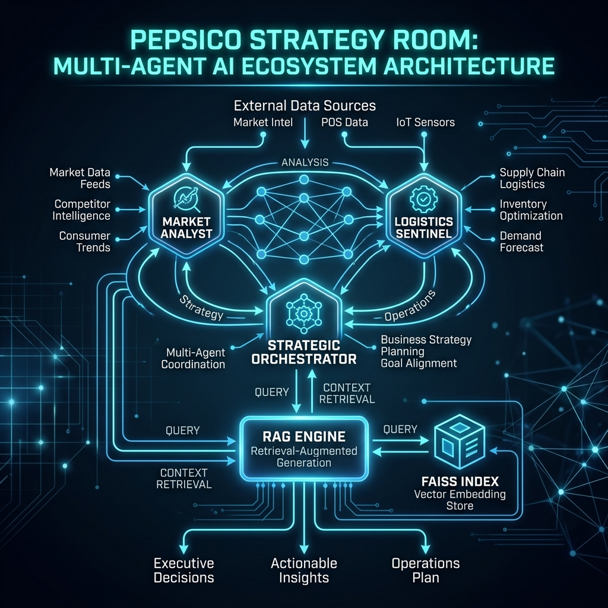
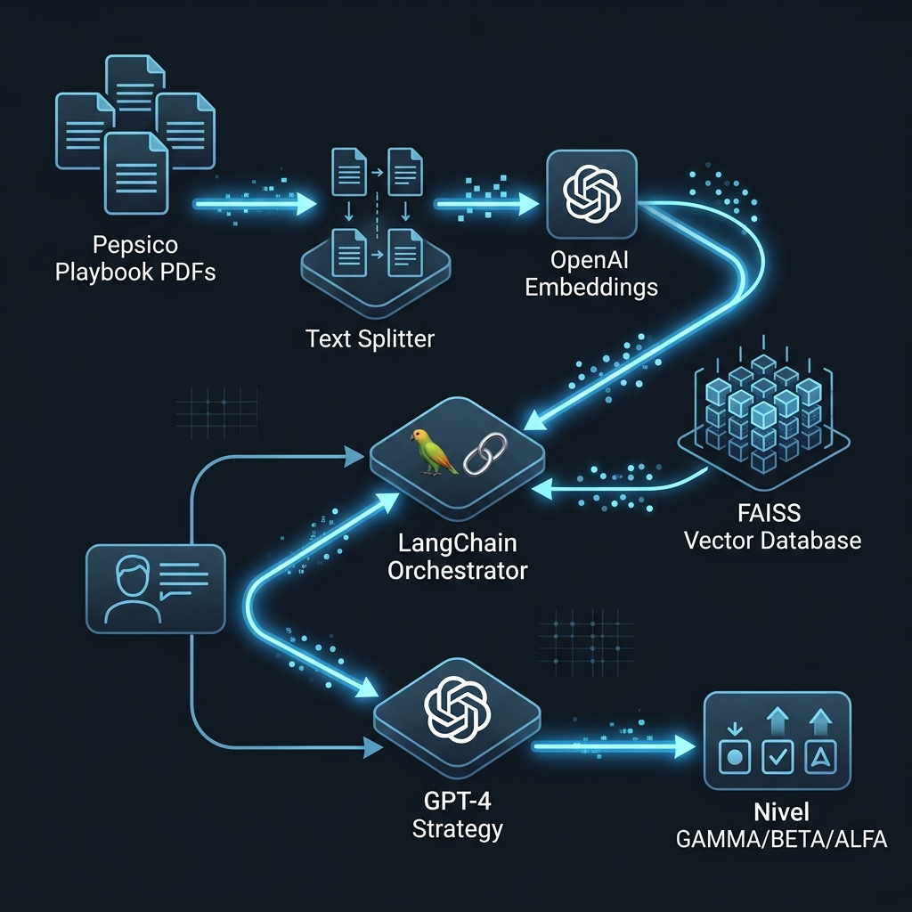

# 🧠 Pepsico Strategy Room: Full Autonomous V4



> Un ecosistema multi-agente de Inteligencia Artificial que orquesta, simula y previene caídas de Market Share para el territorio de Bogotá, integrando un motor **RAG (Retrieval-Augmented Generation)** alimentado por el Playbook Estratégico de Pepsico.

---

## 📌 Topología Multi-Agente del Sistema

Este sistema se fundamenta en tres agentes interconectados, diseñados cognitivamente empleando flujos de **LangChain** y dotados de memoria cruzada. El ciclo de vida de una auditoría semanal es procesado de forma asíncrona por ellos:

1. **🧑‍💻 Market Analyst (Detector de Demanda):**
   - **Habilidad**: Detección de fugas de Market Share interactuando con los deltas de `Ventas_Valor`.
   - **Protocolo de Inferencia**: Actúa como un observador primario de la varianza del precio frente a un umbral (ej. la regla psicológica de $2.500 COP). Analiza el ruido del mercado en función de un "Sentimiento VOC" (Voice of Customer) simulado por series de tiempo.
   - **Salida**: Genera alertas contextuales y alimenta la memoria a corto plazo del entorno.

2. **🚚 Logistics Sentinel (Centinela de Suministro):**
   - **Habilidad**: Computación de variaciones de tiempos logísticos (Retraso_Min) e impacto en **OSA** (On-Shelf Availability).
   - **Protocolo de Inferencia**: Actúa en paralelo evaluando el estrés de distribución local por localidad. Traduce el retraso bruto a probabilidade de impacto en lineal.
   - **Salida**: Integra parámetros probabilísticos al bloque de decisión del orquestador.

3. **🧠 Strategic Orchestrator (RAG Decision Maker):**
   - **Habilidad**: Mediación táctica empleando lineamientos documentales reales del negocio.
   - **Protocolo de Inferencia**: Lee el estado consolidado del Analista y del Centinela desde el `memory_log` y los inyecta en un contexto de validación estructurada. Dictamina el nivel de respuesta:
     - **Nivel GAMMA**: Intervención Extrema ante caída fuerte.
     - **Nivel BETA**: Reestructuración ante fallos logísticos superpuestos.
     - **Nivel ALFA**: Optimización de rutina con flujo estable.

---

## ⚙️ Arquitectura Técnica y Entrenamiento (RAG Engine)



El motor principal ("Cerebro" de la aplicación) recae en la clase `PepsicoRAG` ubicada en `rag_engine.py`, el cual entrelaza Modelos Fundacionales con Data Propietaria.

### 1. Vectorización y FAISS
El sistema carga reglas del negocio desde la carpeta `knowledge_base` empleando `PyPDFLoader`. La partición (chunking) corre bajo un `RecursiveCharacterTextSplitter` con ventanas superpuestas para evitar pérdida de contexto sintáctico y es integrado a un Vector Store local mediante **FAISS** indexando `OpenAIEmbeddings`.
*(En caso de fallo en la carga, inyecta un baseline semántico por defecto con las 4 Reglas de Oro para garantizar operatividad continua).*

### 2. LangChain Stuff Documents Chain
Cuando ocurre un evento de decisión, el Orquestador:
1. Recupera la memoria a corto plazo de los agentes.
2. Inyecta este log como parámetro en el `PromptTemplate`.
3. Llama al `retriever` para interceptar la directriz más aproximada (Similarity Search).
4. El LLM (`ChatOpenAI` con `gpt-3.5-turbo`) responde con directivas rígidas estipuladas por su "System Message".

### 3. Forecasting Engine y Sandbox Chat
El Orquestador ostenta una directiva de "**JSON CONTROL**". En su arquitectura de prompt, está forzado a devolver un componente estructurado al final de su cadena textual que demarca `{"is_simulation": boolean, "objetivo_alcanzado_estimado": float}`. Esto permite a Streamlit renderizar proyecciones algorítmicas bajo esquema frontend, posibilitando a un gerente consultar proyecciones "What If...".

---

## 🚀 Despliegue Técnico y Stack

El frontend interactivo se construyó con **Streamlit** aprovechando integraciones como:
- **PyDeck (`pdk`)**: Renderización de *Heatmaps* por radio geolocalizado calculado mediante coeficientes de riesgo estocásticos.
- **Plotly Express (`px`)**: Gráficos *Sunburst* o drill-down para explorar la Causalidad subyacente de fallas (Competencia, Logística POP, etc.).

### Instalación Local
1. Clona el repositorio.
2. Instala los requerimientos: `pip install streamlit pandas numpy plotly pydeck langchain-openai langchain-community langchain-text-splitters faiss-cpu pypdf python-dotenv`
3. Crea un archivo `.env` en la raíz e inyecta tu variable de OpenAI: `OPENAI_API_KEY=tu-clave-aqui`
4. Ejecuta:
```bash
streamlit run app.py
```

---

> *"Data doesn't make decisions. Agents acting upon contextualized intelligence do."* 
> — **Pepsico Bogota Data Quality Principles**
